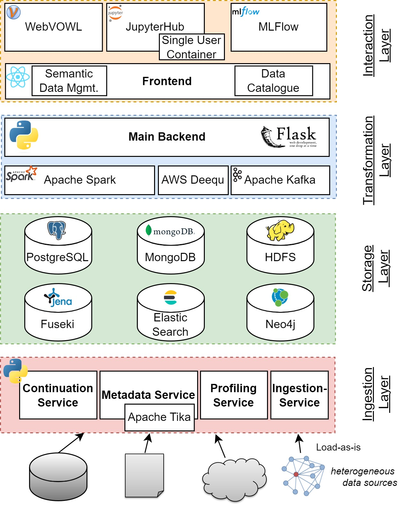

# SEDAR: A Semantic Data Reservoir for Heterogeneous Datasets
## Overview

This is a figure that represents the architecture of the system. All individual elements are shipped in Docker containers.
<p align="center">

</p>

Data lakes have emerged as a solution for managing vast and diverse datasets for modern data analytics. To prevent them from becoming ungoverned, semantic data management techniques are crucial, which involve connecting metadata with knowledge graphs, following the principles of Linked Data. This semantic layer enables more expressive data management, integration from various sources and enhances data access utilizing the concepts and relations to semantically enrich the data. Some frameworks have been proposed, but requirements like data versioning, linking of datasets, managing machine learning projects, automated semantic modeling and ontology-based data access are not supported in one uniform system. We demonstrate SEDAR, a comprehensive semantic data lake that includes support for data ingestion, storage, processing, and governance with a special focus on semantic data management. The demo will showcase how the system allows for various ingestion scenarios, metadata enrichment, data source linking, profiling, semantic modeling, data integration and processing inside a machine learning life cycle.

 ## [Demo Video](https://data-science.hsnr.de/SEDAR-CIKM.mp4)

## Publications
- [SEDAR: A Semantic Data Reservoir for Heterogeneous Datasets](https://doi.org/10.1145/3583780.3614753)
- [SEDAR: A Semantic Data Reservoir for Integrating Heterogeneous Datasets and Machine Learning](https://ercim-news.ercim.eu/images/stories/EN133/EN133-web.pdf) (Page 27)

The code in this repository is related to the earlier publication (ERCIM NEWS). The code related to semantic modeling and OBDA for the CIKM publication will be released later.

## Cite this work:
Sayed Hoseini, Ahmed Ali, Haron Shaker, and Christoph Quix. 2023. SEDAR: A Semantic Data Reservoir for Heterogeneous Datasets. In Proceedings of the 32nd ACM International Conference on Information and Knowledge Management (CIKM ’23), October 21–25, 2023, Birmingham, United Kingdom. ACM, New York, NY, USA, 5 pages. https://doi.org/10.1145/3583780.3614753

```bib
@inproceedings{DBLP:conf/cikm/HoseiniASQ23,
  author       = {Sayed Hoseini and
                  Ahmed Ali and
                  Haron Shaker and
                  Christoph Quix},
  editor       = {Ingo Frommholz and
                  Frank Hopfgartner and
                  Mark Lee and
                  Michael Oakes and
                  Mounia Lalmas and
                  Min Zhang and
                  Rodrygo L. T. Santos},
  title        = {{SEDAR:} {A} Semantic Data Reservoir for Heterogeneous Datasets},
  booktitle    = {Proceedings of the 32nd {ACM} International Conference on Information
                  and Knowledge Management, {CIKM} 2023, Birmingham, United Kingdom,
                  October 21-25, 2023},
  pages        = {5056--5060},
  publisher    = {{ACM}},
  year         = {2023},
  url          = {https://doi.org/10.1145/3583780.3614753},
  doi          = {10.1145/3583780.3614753}
}
```
## Contact
For any setup difficulties or other inquiries, please contact: data-science@hsnr.de 

License
-------

This project is openly shared under the terms of the __Apache License
v2.0__ ([read for more](./LICENSE)).

## Acknowledgement

We acknowledge the cooperation with A. Martin, M. Thiel, R. Kuller, L. Beer, F. Lentzen, F. Bongartz, M. Noman, T. Claas, M. Fallouh, Z. Abdullah gratefully who made this work possible. 
This work has been sponsored by the German Federal Ministry of Education and Research, Germany in the funding program “Forschung an Fachhochschulen”, project \href{https://www.hs-niederrhein.de/i2dach}{$I^2DACH$} (grant no. 13FH557KX0).


# Installation
The following installation instruction have been tested on a Debian GNU/Linux 11 (bullseye) virtual machine with 32GB RAM and 8 CPUs, Architecture x86_64. <br />

For the development we have been connecting to the VM via SSH using Visual Studio Code. This complicates the setup a little, because ports have to be forwarded to your local machine. In case you are developing locally, the setup is simplified, however you might face other problems in configuring for example the spark cluster, HDFS, etc. <br />

1. Install the following via terminal. <br />
    * Git: <br />
            
                apt-get install git curl build-essential gcc ffmpeg libsm6 libxext6  -y

        - Clone the repository: <br />
            
                git clone https://github.com/hsnr-data-science/SEDAR.git

    * Docker : <br />
    An installation guide for Docker can also be found at:
            https://docs.docker.com/desktop/install/linux-install/ <br />
        - Setup the repository, update the apt package index and install packages to allow apt to use a repository over HTTPS:<br />
            
                sudo apt-get update
                sudo apt-get install ca-certificates curl gnupg

        - Add Docker’s official GPG key: <br />
                
                sudo install -m 0755 -d /etc/apt/keyrings 
                curl -fsSL https://download.docker.com/linux/debian/gpg | sudo gpg --dearmor -o /etc apt/keyrings/docker.gpg 
                sudo chmod a+r /etc/apt/keyrings/docker.gpg

        - Use the following command to set up the repository: <br />
            
                echo \ "deb [arch="$(dpkg --print-architecture)" signed-by=/etc/apt/keyrings/docker.gpg] https://download.docker.com/linux debian \ "$(. /etc/os-release && echo "$VERSION_CODENAME")" stable" | \ sudo tee /etc/apt/sources.list.d/docker.list > /dev/null

    * Docker Engine: <br />
        - Update the apt package index: <br />
            
                sudo apt-get update

        - Install Docker Engine, containerd, and Docker Compose. To install the latest version, run: <br />
            
                sudo apt-get install docker-ce docker-ce-cli containerd.io docker-buildx-plugin docker-compose-plugin
        
        - Verify that the Docker Engine installation is successful by running the hello-world image: <br />
            
                sudo docker run hello-world
          <br />

           Continue to [Linux postinstall](https://docs.docker.com/engine/install/linux-postinstall/) to allow non-privileged users to run Docker commands and for other optional configuration steps. <br /> 
    
    * NVM (Node Version Manager) <br />
        With NVM it is much easier to make changes in NodeJS and npm.
        
                curl https://raw.githubusercontent.com/creationix/nvm/master/install.sh | bash 

                source ~/.bashrc

    * npm and NodeJS: <br />
        - Install npm and Node.js by using NVM. <br />
                
                nvm install v18.16.0 
        
        -  Use this to check which Node.js version you installed. <br />
                
                node -v && npm --version

        - execute this command below to be able to use npm without sudo on port 80.
                
                sudo setcap 'cap_net_bind_service=+ep' `which node`
        
        - installation guide for NodeJS can also be found at this site: <br />
            https://www.knowledgehut.com/blog/web-development/install-nodejs-on-ubuntu

    * Python3: <br />
        - We're running PySpark version 3.1.2 on Python 3.9  <br />
            
                        sudo apt-get install python3.9
    
    * pip: & python-venv <br />
                
                sudo apt install python3-pip python3-venv -y

        - Upgrade pip: <br />
            
                pip install --upgrade pip

2. Configure the system
   Check out the [example.env](https://github.com/hsnr-data-science/SEDAR/blob/main/SEDAR/.env.example). This is the main config file to define all ports and host IP addresses, secret keys, URLs etc. It is configured to work as a standalone solution with no external JupyterHub or GitLab Identity provider. An important key is 
        
        BACKEND_HOST=<ipaddressofhostsystem>

   In our VM setup, we used the IP address of the VM host, e.g. 192.168.220.100. This key is important to ensure services, frontend and backend will be able to communicate with each other.  <br />
   Copy the content of example.env into a file called .env and adjust according to your needs.  <br />

4. Build, pull and run containers. First, change Directory to SEDAR/src, then:

    1. commons.yaml <br />
        Now start running the command bellow:    
        
            docker compose -f commons.yaml build

    2. services.yaml <br />
        
            docker compose -f services.yaml build

    3. dev.yaml <br />
        
            docker compose -f dev.yaml build

Running requires only services.yaml and dev.yaml. Commons does not need to be run.  <br />
   4. dev.yaml <br />
        
            docker compose -f dev.yaml up -d
            
Make sure Kafka is up and running. The services need to be able to succesfully connect to Kafka.  <br />
   5. services.yaml <br />
        
            docker compose -f services.yaml up -d

6. Frontend <br />
    * Use the command below to install dependencies which locates in SEDAR/src/frontend/: <br />
        
            npm install
    * Run sedar frontend: <br />
        
            npm run start

7. Backend <br />
    * Create virtual enviroment (named flask) using the command: <br />
        
            python3 -m venv flask
        And activate the virtual enviroment. After activating you will see your directory will change. 
        Directory will be now under (flask) enviroment. <br />
        
            source flask/bin/activate
    * install the requirement files that are shown below to virtual enviroment: <br />
        SEDAR/backend/mainbackend/requirements.txt <br />
        SEDAR/backend/commons/requirements.txt <br />
            
                pip install -r ./SEDAR/src/backend/commons/requirements.txt
                pip install -r ./SEDAR/src/backend/mainbackend/requirements.txt


8. HDFS connectivity: <br />
    - run the command:

                sudo nano /etc/hosts
        type namenode datanode1 next to YOUR:IP:ADDRESS localhost then exit with ctrl+X and save changes by pressing Y.
9. Debugging in VS Code
To debug the mainbackend or individual services we have been using python extension in vscode.  <br />
    - Create a launch.json from Run & Debug Tab and past the following content. Make sure to adjust the filepaths to your system and also to kill corresponding containers first. 

                {
                "version": "0.2.0",
                "configurations": [
                {
                "name": "Mainbackend",
                "python":"/home/<USER_NAME>/SEDAR/src/backend/mainbackend/flask/bin/python3",
                "type": "python",
                "request": "launch",
                "cwd": "/home/<USER_NAME>/SEDAR/src/backend/mainbackend",
                "program": "main_server.py",
                "console": "integratedTerminal",
                "envFile": "/home/<USER_NAME>/SEDAR/src/.env",
                },
                {
                "name": "Ingestion Service",
                "python":"/home/<USER_NAME>/SEDAR/src/backend/mainbackend/flask/bin/python3",
                "type": "python",
                "request": "launch",
                "cwd": "/home/<USER_NAME>/SEDAR/src/backend/mainbackend",
                "program": "server.py",
                "console": "integratedTerminal",
                "envFile": "/home/<USER_NAME>/SEDAR/src/.env",
                },
                {
                "name": "Continuation Service",
                "python":"/home/<USER_NAME>/SEDAR/src/backend/mainbackend/flask/bin/python3",
                "type": "python",
                "request": "launch",
                "cwd": "/home/<USER_NAME>/SEDAR/src/backend/mainbackend",
                "program": "server.py",
                "console": "integratedTerminal",
                "envFile": "/home/<USER_NAME>/SEDAR/src/.env",
                },
                {
                "name": "Schema Service",
                "python":"/home/<USER_NAME>/SEDAR/src/backend/mainbackend/flask/bin/python3",
                "type": "python",
                "request": "launch",
                "cwd": "/home/<USER_NAME>/SEDAR/src/backend/mainbackend",
                "program": "server.py",
                "console": "integratedTerminal",
                "envFile": "/home/<USER_NAME>/SEDAR/src/.env",
                },
                {
                "name": "Profiling Service",
                "python":"/home/<USER_NAME>/SEDAR/src/backend/mainbackend/flask/bin/python3",
                "type": "python",
                "request": "launch",
                "cwd": "/home/<USER_NAME>/SEDAR/src/backend/mainbackend",
                "program": "server.py",
                "console": "integratedTerminal",
                "envFile": "/home/<USER_NAME>/SEDAR/src/.env",
                }
              ]
          }

    - Alternatively, you can run the servides inside terminals as well. Create four terminals to run ingestion, continuation, schema and profiling services.
      Make sure you have activated virtual enviroment 'flask' and for all terminals use the commands in order. Make sure to adjust the filepaths to your system and also to kill corresponding containers first:
                
                cd SEDAR/src/backend/services/ingestion/
                python3 server.py

                cd SEDAR/src/backend/services/continuation/
                python3 server.py

                cd SEDAR/src/backend/services/schema/
                python3 server.py

                cd SEDAR/src/backend/services/profiling/
                python3 server.py
10. Port-Forwarding
The follwing ports need to be forwarded to host system in case of running SEDAR inside a SSH-V. These are based on the standard definition given in example.env:  <br />
   80 Frontend port  <br />
   5000 Backend port  <br />
   8088 WebVOWL <br />
   7687 Neo4j <br />
   8000 Jupyter <br />
